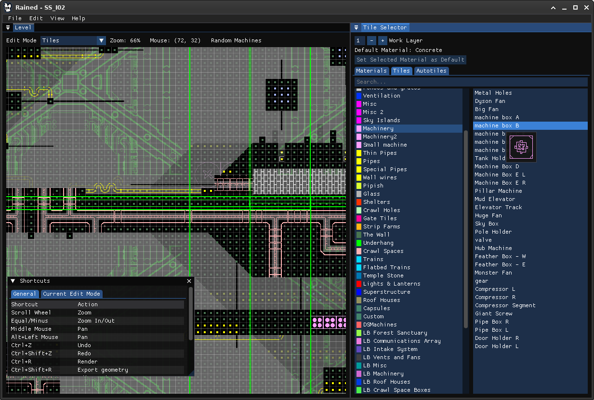
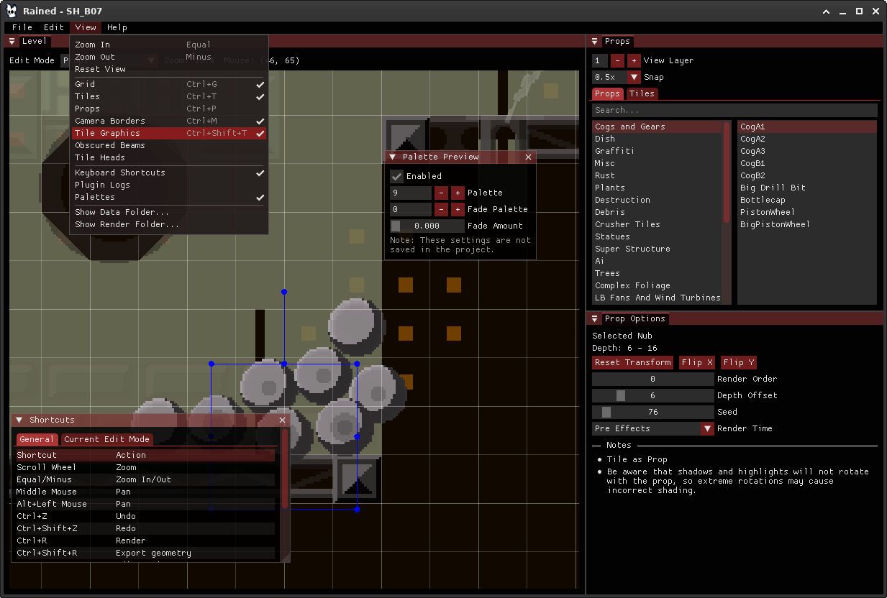

# Rained
<p align="center">
    
</p>

Another Rain World level editor. Read [this document](dist/README.md), which is bundled with every release package, for more information on how to use this software.

Please note that the "main" branch is ahead of the latest release. If you want to access the repository
at the time of a certain release, use the Git tags system.

## Features
- Ease of use
- Undo/redo everything
- Re-envisioned prop editor
- Highly customizable UI
- Asset graphics and palette previews
- [Drizzle](https://github.com/SlimeCubed/Drizzle/tree/community) level rendering with a preview
- Exiting from the light editor does not mess up the screen
- Pressing escape does not crash the program

## Screenshots



## Building
Prerequisities:
 - .NET Core toolchain
 - *(optional)* OpenGL ES driver or [ANGLE libraries](src/Glib/angle) in the DLL search path.
 - *(optional)* Python 3
 - *(optional)* [glslang](https://github.com/KhronosGroup/glslang) CLI

### .NET CLI
Clone with Git:
```bash
git clone --recursive https://github.com/pkhead/rained
cd rained
```

Compile Drizzle
```bash
cd src/Drizzle
dotnet run --project Drizzle.Transpiler
```

Back to the root directory, build and run Rained
```bash
# only needs to be run once
dotnet tool restore

# usage of desktop GL or GLES/ANGLE is determined by OS.
dotnet cake

# alternative build command with desktop GL forced on.
dotnet cake --gles=false

# run the project!
dotnet run --no-build --project src/Rained/Rained.csproj
```
Upon first startup, you can configure where your Data folder is located. If you chose to download and install it, Rained will download and extract [this repository](https://github.com/SlimeCubed/Drizzle.Data/tree/community).

### Documentation
The documentation is built using [Material for MkDocs](https://squidfunk.github.io/mkdocs-material/). You'll need python and pip to build it.

```bash
# install material for mkdocs
pip install mkdocs-material

# serve docs on http://localhost:8000
mkdocs serve

# build doc site
mkdocs build
```

## Contributing
Report bugs and other complaints by creating an issue or pinging @chromosoze on a Rain World modding Discord server. DM requests also work, but it's likely that it'll take me a while to notice them as I don't pinged for it.

Pull requests are welcome.

### Subprojects
Rained has multiple projects in the C# solution. Here is a list of their brief descriptions:

|                    |                                                            |
| ------------------ | ---------------------------------------------------------- |
| **Drizzle**        | Port of the original renderer from Lingo to C#.            |
| **Glib**           | OpenGL 3.3/OpenGL ES 2.0 and Silk.NET wrapper.             |
| **Glib.ImGui**     | ImGui.NET backend for Glib/Silk.NET.                       |
| **Glib.Tests**     | Test program for Glib visual output.                       |
| **ImGui.NET**      | Freetype-enabled version of ImGui.NET.                     |
| **Rained**         | The entire Rained application.                             |
| **Rained.Console** | C application to launch Rained from a console environment. |
| **Rained.Tests**   | A few unit tests for Rained.                               |

### The "nightly" tag
The "nightly" tag really only exists so that I'm able to create nightly GitHub releases. It's a bit annoying. I wouldn't recommend interacting with it.

Since the action deletes and re-creates the "nightly" tag on every release, in order to update the tag
on your clone (not that you would want to, I suppose), you would have to run the following Git commands:
```bash
git tag -d nightly # delete the nightly tag on your clone
git fetch origin tag nightly # fetch the nightly tag from origin
# running `git fetch` or `git pull` itself after deleting the tag should also work.
```
