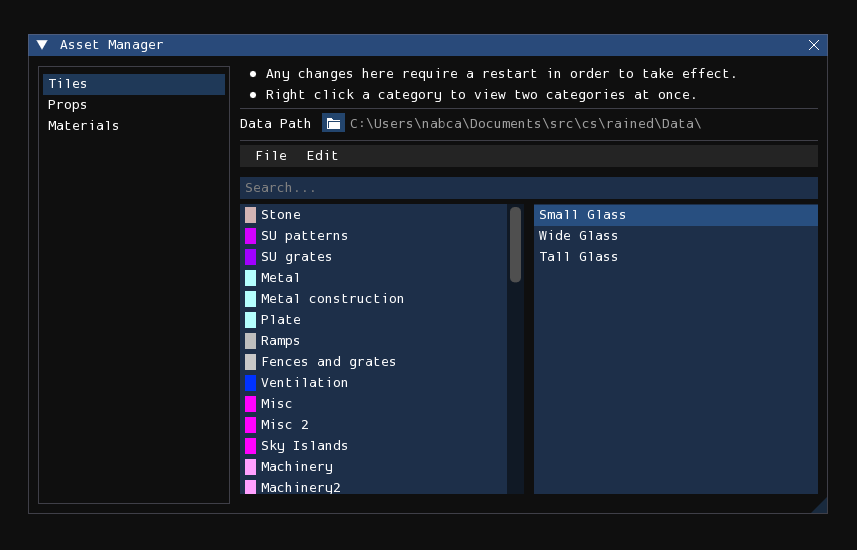
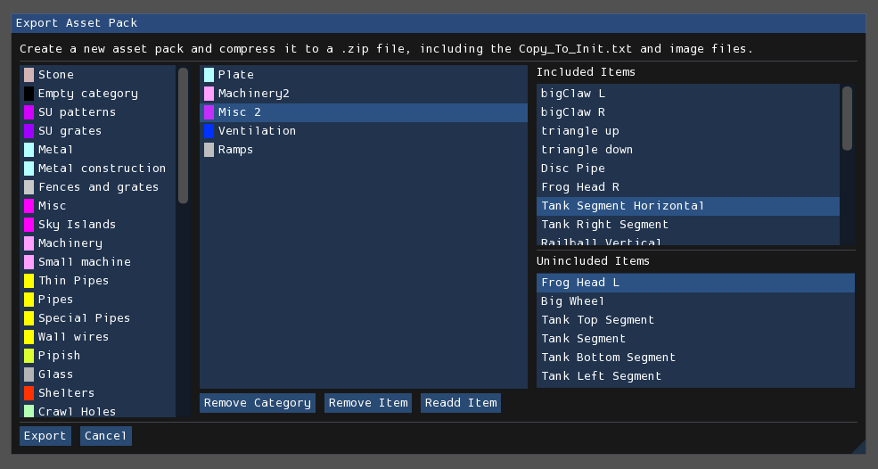

# Asset manager

<figure markdown="span">
    
</figure>

The asset manager is used to assist in modifying the tile, prop, and
material `Init.txt` files. Rather than modifying those files by hand in a text
editor, which may be cumbersome and tedious, you can instead use this asset
manager to do so in a more intuitive and less error-prone graphical fashion.
Additionally, it also provides functionality to automatically import other init
files, and functionality to export selected assets into an asset pack as a
ZIP-compressed archive.

The asset manager is accessed by pressing **Tools > Asset Manager** from the
menubar.

!!! note

    Changes made or saved to disk in the asset manager will not apply to Rained
    until you relaunch the program.

## Interface

On the left is a sidebar which lets you change which init file you are viewing
and modifying. "Tiles" corresponds to `Graphics/Init.txt`, "Props" to
`Props/Init.txt`, and "Materials" to `Materials/Init.txt`, although that option
will be grayed out if that file does not exist.

### Catalog editor

The largest section of the window is dedicated to the catalog editor, which
allows you to browse and edit categories and the placement of individual assets
in the selected init file. It functions equivalently to the asset browsers of
the respective edit modes, but with additional functionality for editing
purposes.

You can drag and move categories to reorder them. You can also do the same for
assets to reorder them from within the category or move them to a different
category.

However, when moved to a different category, the asset will be placed
at the bottom of the target category. For finer control, you can right-click on
a category to open split-view mode, which lets you view two categories at once
for the purpose of controlling where an asset will be placed when trying to move
one into another category. Right-click on a category again to close split-view
mode.

### Menubar

The menubar contains the following items:

**File**:

- **Import Init.txt**: This begins the process of an init import, detailed
  [later in this chapter](#importing-init-files).
- **Apply Changes**: Any changes made to the init are not saved to disk until
  you press this button.
- **Export .zip**: This begins the process of an asset pack export, detailed
  [later in this chapter](#asset-pack-export)

**Edit**:

- **Delete Category**: This deletes the currently selected category.
- **Delete Asset**: This deletes the currently selected asset.
- **Edit Category**: This lets you change the name and color (if available) of
  the currently selected category.
- **Edit Asset**: This lets you change the name of the currently selected asset.

!!! note

    The asset manager will remind you that you have unsaved changes when you try
    to close the window without saving.

## Importing init files

To begin the process of importing an init file, select the
**File > Import Init.txt** menu item from the menubar of the asset manager. It
will, first, open a file browser expecting you to select an Init.txt file of the
currently selected asset type to import. Once given, it will then ask you for
your choice of import method, of which there are three: Replace, Append, and
Merge.

Replace and Append are very simple and naive import methods: Replace simply
replaces the contents of the current init file with the init to import, and
Append concatenates the contents of the current init file with the init to
import, without attempting to check for or fix duplicate categories or assets.
The Merge mode, however, is more complex, as it attempts to address duplication.

### Merge behavior

Definitions:

- **Source init**: The init file that is being imported—the one that you have
  selected in the file browser. This init file is not being modified.
- **Destination init**: The init file that the source init is being merged to.
  This init file is being modified, although the changes are only saved to disk
  when you select **File > Apply Changes** from the asset manager menubar.
- **Asset definition**: The line declaring and describing an asset. Furthermore,
  "old" means it is from the destination init, and "new" means it is from the
  source init.
- **Asset equivalence**: An asset is defined by name: two definitions declare
  the same asset if they both declare the same asset name.

The merge process will attempt to import every category and asset definition
from the source init. It can do this silently and successfully given that the
following conditions are met:

- A definition with the same name does not exist in the destination init.
- The asset is not defined multiple times in the source or destination init.

Otherwise, it will pause the merge access to query user decision via a prompt.

!!! note

    The merge process will abort if a category with the same name exists in both
    the source and dest init, but have differing colors.

If the asset is defined multiple times in the source init, it must first be
decided which asset definition should be used when merging. A prompt will open
with the header, "Multiple definitions of (asset name)", and show a list of
radio buttons which you can use to decide which definition should be used for
import.

Afterwards, if the asset in the destination init exists in a different category
than where it is in the source init, or if the destination init defines the
same asset multiple times, the merge process cannot automatically decide where
to place the asset; a prompt will open with the header "Merge conflict
with asset (asset name)". Multiple checkbox options will appear, with which
none or multiple can be selected simultaneously. The last option will always be
"Add to (category)", where the written category is the name of the category the
new definition is located in. The remaining options, if applicable, when
checked, indicate that it should overwrite an old definition of the asset
located in the written destination category.

Mutually exclusive to the previous condition, if there is only one definition of
the asset in the destination init, and if the the new asset is also defined in
the destination init, and both definitions are in the same category, a prompt
will open simply asking a yes/no question of if you want to overwrite the
definition; that is, if you want the new definition to replace the old one. You
can also choose to have the option apply to all subsequent merge conflicts of
this kind.

!!! important

    Cancelling the merge operation at any point will revert the asset catalog to
    how it is on disk.

## Asset pack export

<figure markdown="span">
    
</figure>

This interface is used to export certain assets to a ZIP-compressed archive
that includes the associated image files for each asset (if applicable) and the
relevant asset definitions within a file named `Copy_To_Init.txt`.

!!! info

    The benefits of using this system includes being able to specify items
    without the need to separate the files manually, over taking the time to
    copy and paste init lines yourself.

The leftmost list in the interface displays the list of available categories
that may be selected to mark for inclusion in the asset pack. The center
list displays the list of categories marked for inclusion. The rightmost section
of the interface displays both the list of included assets within the selected
included category, and the list of exclusions within that same category. If
there are no excluded assets, then the exclusion list will not appear. All
assets are included within a category by default.

Pressing the "Export" button the bottom-left will open a file browser expecting
you to specify the path where the ZIP archive containing the asset pack will be
stored.