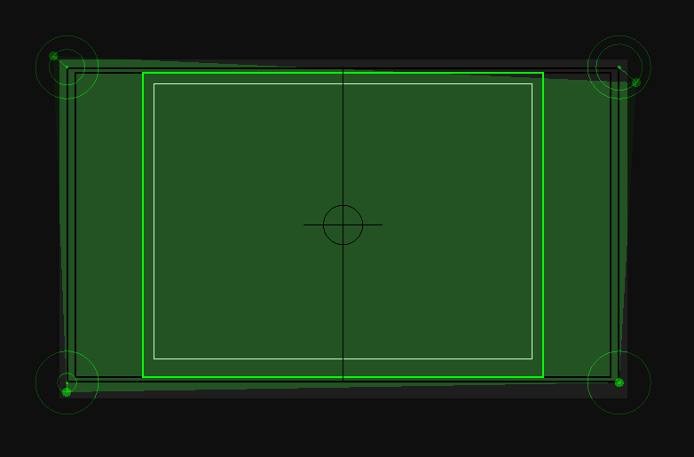
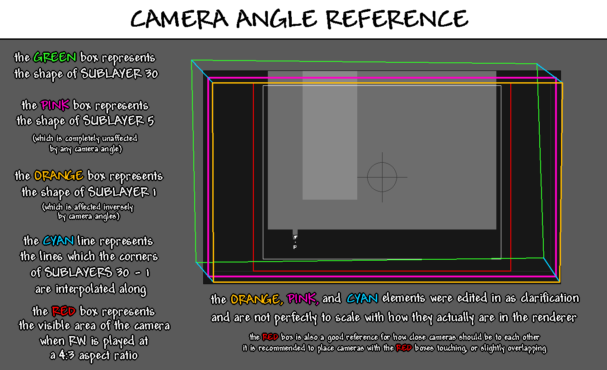

# Cameras
This is the editor where you can place and move cameras. Each camera represents an individual screen in a room and will always map to one rendered .png file.

## Editing
Cameras are represented by green rectangles/quadrilaterals. You can select cameras by clicking on them, and you can move them by dragging them around. Multiple cameras can be selected at once by holding <kbd>Shift</kbd> while selecting another camera. Selected cameras can be deleted by pressing the <kbd>X</kbd> key. You may also add cameras by either double-clicking on an empty space or by pressing the <kbd>C</kbd> key.

By default, cameras can only be viewed in the camera editor, but by enabling **View > Camera Borders**, you can view the outlines of cameras in all editors, colored green. Which outlines will be visible is determined by the *Camera border view mode* option in the Preferences window.

### Snapping
Usually, cameras are aligned in a grid, which is why Rained allows you to snap them together. Cameras can be aligned with other cameras by holding the <kbd>A</kbd>/<kbd>D</kbd> or <kbd>W</kbd>/<kbd>S</kbd> key, while moving one or more cameras, and moving a camera near the axis another camera lies on.

However, unless you want to be compatible with mods that implement camera scrolling (i.e. SBCameraScroll), this is not required. Otherwise, while playing with a scrolling mod, there may be visual artifacts resulting from the absence of a visual for portions of the screen.

## Boundaries
Each camera has three concentric boundaries. Sorted from largest to smallest, these are:

1. The entire rendered area. The bounds of this area is shown with a black outline.
2. The entire visible area when Rain World is played with a 16:9 aspect ratio. The bounds of this area is also shown by a black outline. It is slightly smaller than the full size of the screen to accommodate for screen shake.
3. The entire visible area when Rain World is played with a 4:3 aspect ratio. The bounds of this area is shown by a green outline (though red in the official editor). It also serves as the in-game area where the game will switch cameras once the player intersects with it.

## Angles
Each camera has a movable point at each of their four corners, represented by the green rings and the dot that appear on selected cameras. These control the vertices of the camera quad, colored green.

<figure markdown="span">
    
    <figcaption>Camera quad points, each with a different offset.</figcaption>
</figure>

Each dot is the location of the relevant vertex of the camera quad, and the outer ring for each camera angle represents the maximum distance the dot can be from its origin. If you want to move the point outside of its bounds, you can do so by holding <kbd>Shift</kbd>. Alternatively, you can enable the *Unlock camera angles* setting to invert that behavior.

The green quad itself controls how the perspective of the level render will be warped. Each render is comprised of 30 sublayers. The fifth closest sublayer of each render is always a perfect rectangle, but the farther back the sublayer is, the more intense the warping becomes, until the furthest layer's shape matches the green quad. In effect, it allows the editor to control the angle the level is viewed at in a psuedo-3D fashion, as well as how weak or strong the perspective effect will be.

Below is an image explaining camera angles alongside a visual:

<figure markdown="span">
    
    <figcaption>Image credit: [Mayhemmm](https://github.com/mayhemmmwith3ms)</figcaption>
</figure>

## Render order
Cameras are rendered in order from first created to last. The order that cameras will be rendered in can be shown by enabling the *Show camera numbers* option in the preferences window. They will shown as white numbers in the middle of a camera.

You can't do much to change the order of cameras, other than moving or recreating them in the order you want. However, you can set which camera should be rendered first by selecting a camera and pressing **Edit > Set Priority**. Only one camera can be prioritized at a time. Also, this flag is not saved in the level file and therefore will be reset on the next reload. If you want to remove the priority status of any camera, simply press **Edit > Clear Priority**. You do not need to have the relevant camera selected to do this.