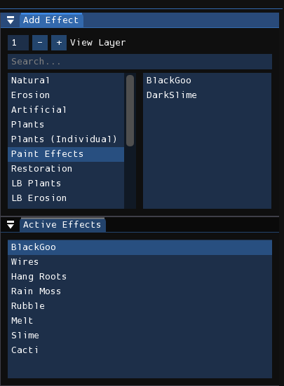
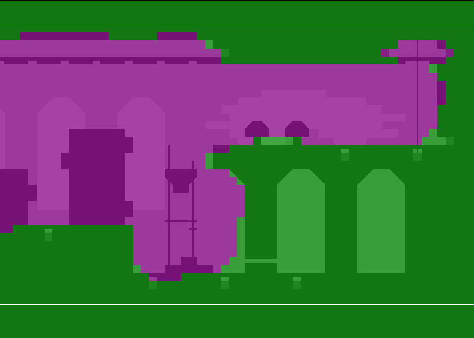

# Effects
The effects editor is used to add procedurally generated effects to the level. Many of them manipulate pixels in the rendered image to make stuff, for example, look like they're drooping. Some effects may add decorative objects in the level, such as plants, grass, wires, chains, etc.

<figure markdown="span">
    
    <figcaption>The effects catalog and list of active effects.</figcaption>
</figure>

To create an effect, find the effect you want in the "Add Effect" window and click on it. A new instance of the effect will be added to the "Active Effects" list. Multiple instances of the same effect can be added. Afterwards, you may reorder the order that effects are rendered by clicking and dragging, or by pressing the "Move Up" and "Move Down" buttons. They can also be deleted by right-clicking on them or pressing the "Delete" button.

When adding an effect, it will be placed on the bottom of the active effects list. However, if you already have an effect selected and hold <kbd>Shift</kbd>, it will instead be inserted above the currently selected effect. This behavior may also be altered by changing the **Effect placement position** and **Effect placement alt position** preferences.

!!! tip

    The two most commonly used effects are BlackGoo and Slime. BlackGoo is used to create a "fog of war" effect, blacking out any solid geometry under it, and permeates the walls of indoor rooms rooms more than outdoor rooms. Slime is a basic erosion drooping effect, and is used in virtually every level.

## Effect Matrix
<figure markdown="span">
    
    <figcaption>Example BlackGoo effect matrix.</figcaption>
</figure>

With an effect active, its effect matrix will be shown in the level view. The effect matrix controls the strength of the effect at certain locations, where
pink represents no effect and green represents a stronger effect. You paint green by holding down the left mouse button, and you paint pink by holding down
the right mouse button. You can change the radius of your brush by holding <kbd>Shift</kbd> and moving the scroll wheel.

Some effects affect how you edit the effect matrix in a slightly different way. For example, when you create BlackGoo it creates a filled effect matrix
rather than an empty one. Some effects, like BlackGoo and the ones in the "Plants (Individual)" category, only allow you to paint in the range of two values:
full strength or no effect at all.

## Options
Each instance of an effect has a set of configurable parameters that affect how they are rendered. Effects can use their own custom options,
but the following is a list of common ones:

- **Layers:** The layers that the effect will render in.
- **3D:** The effect is applied on a per-sublayer basis.
- **Affect Gradients And Decals:** The effect will affect gradients and decals.
- **Color:** The effect color to use for the plant. There will be the options 1, 2, and X, corresponding to the two effect colors available in the level palette, and X for "Dead", meaning that it will use the normal level palette.
- **Seed:** Seed used for random number generation.