# Geometry
This edit mode is where you edit the room's geometry and interactable objects. The window docked to the right, titled "Build", contains the tools you can use to edit the geometry and place objects, as well as some checkboxes for the layer mask and mirror options.

<figure markdown="span">
    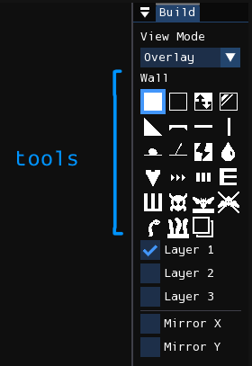
</figure>

## View mode
The view mode controls how each layer is composited in the level viewport.

- **Overlay**: The default view mode. Emulates how layers are displayed in the original level editor: each layer is rendered as a unique transparent color, except for the first layer, being an opaque black.
- **Stack**: Mimics how layers are displayed in RWE+, with the closest active layer being an opaque black, obscuring the
  layers behind, and the rest being transparent.

=== "Overlay"
    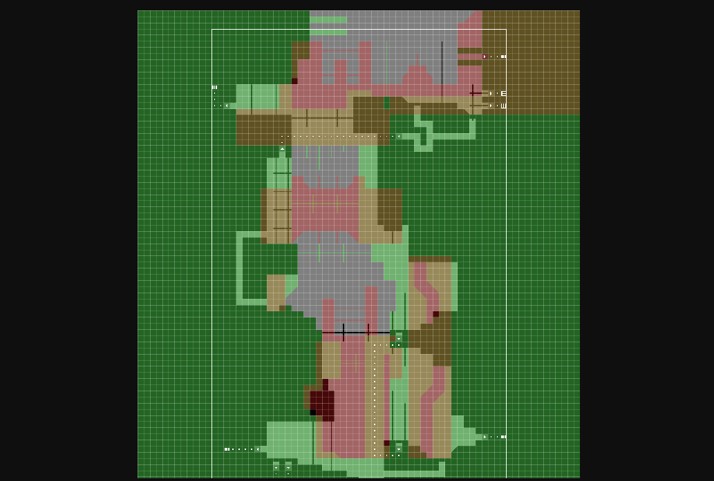

=== "Stack"
    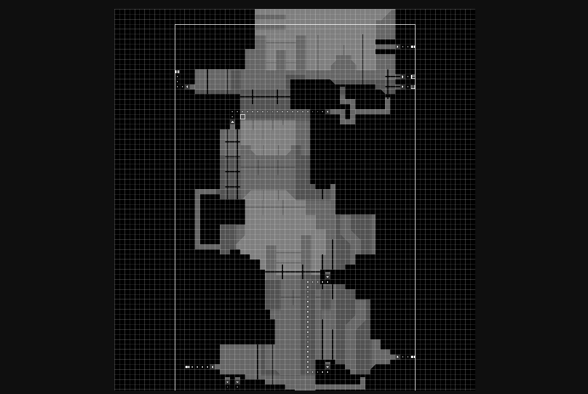

## Tools
You may select a tool from the Build window by clicking on them or by using WASD navigation. Some tools are geometry tools, meaning that they modify the shape of the geometry associated with a cell, while others are object tools, meaning that they instead add or remove what objects are contained in a single cell.

With a tool selected, you can use it by pressing the left mouse button in the level viewport. Pressing the right mouse button will either erase geometry if a geometry tool is selected, or erase all objects in a cell if it is an object tool.

### Tool behavior
Each cell of a level has a geometry type and one or more objects. The geometry types are Wall, Air, Invisible
Wall, Slope, and Platform. Tools that modify geometry types will be named "geometry tools". This also includes Toggle
Wall/Air and Copy Backwards. The rest of the tools will be named "object tools", as they only modify the collection of
objects present in a cell.

The behavior of each geometry tool and type should be self-explanatory, but there are still non-intuitive aspects of them:

- **Wall and Air**: Right-clicking with the tool will place geometry of the opposite type.
- **Invisible Wall**: This is a geometry type that produces a collidable but invisible cell. Right-clicking with the
  tool will place air.
- **Slope**: Slopes can only be placed on corners, as the direction of the slope is automatically calculated from
  context. Right-clicking with the tool will place air. <kbd>Q</kbd>+LMB will create a big slope—this will be explained
  later.

Object tools do not overwrite the contents of the cell, but instead toggle the
existence of the respective object when the left mouse button is pressed. That
is, left-clicking with the "Rock" tool will add a rock if it doesn't already
exist in the cell. Otherwise, it will remove the rock. In contrast,
right-clicking with an object tool will erase all objects in a cell.

You can also edit a rectangular area of the level with one action by clicking
and dragging your mouse while holding <kbd>Shift</kbd>, although this behavior
is disabled for some tools where the behavior has been deemed useless for it.
Once the mouse is released, it will fill or erase the selected rectangular area,
depending on which mouse button you had pressed.

The Slope tool has a special region-based action mode when you have the
<kbd>Q</kbd> key held down while activating it. This mode is used for creating
large slope formations. It constrains the rectangular region to a square shape,
and when the mouse is released it will attempt to construct a slope formation
that matches the size of the square and has a direction inferred by neighboring
geometry. If it could not create a legal slope formation, nothing will be
placed.

### Non-shortcut tools
Here is the list of tools not related to shortcuts:

| Tool | Description |
| -------- | ----------- |
| 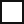 Wall | Solid geometry. If a wall is placed on layer two, then background-climbing creatures like blue lizards can walk on it. |
|  Air | Empty space |
|  Toggle Wall/Air | Corresponds to "Inverse" in the official level editor. Should be obvious. |
|  Slope | A 45-degree slope. Can only be placed on corners. |
|  Invisible Wall | Corresponds to "Glass" in the official level editor. The cell will be collidable but invisible. |
|  Platform | A half-block. In game, you may freely pass through it if entering from the bottom, but in order to go through it from above, you have to hold the down button. |
| 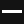/ Beam | Also known as poles. Creatures can climb on them. |
|  Fissure | Corresponds to "Crack Terrain" in the official level editor. You can use this to create a type of tunnel. It's not used in game often. For normal crawl tunnels, you use air blocks. |
| 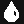 Waterfall | You use this to create decorative waterfalls. Water flows down from the cell that the waterfall object is placed in. |
|  Batfly Hive | Can only be placed on the ground. It makes those spiky white things that batflies burrow into. |
|  Forbid Fly Chain | Placed on the ceiling, and prevents batflies from hanging onto them in chains. |
| 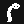 Garbage Worm | Placed in the ground, and can be used to mark a location where a Garbage Worm spawns. |
|  Worm Grass | Placed on the ground. The height of the worm grass is proportional to the width of the patch. |
|  Copy Backwards | Copies the geometry of highlighted area one layer backwards. |

### Shortcuts
Shortcuts, otherwise known as "pipes", are used for inter- or intra-room transportation. Below are four examples of shortcuts. This one is a two-way connection between two points in the same room.

<figure markdown="span">
    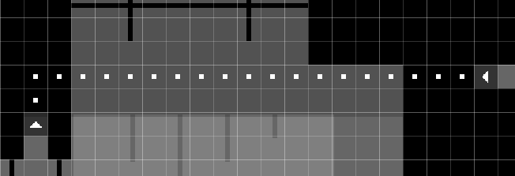
</figure>

This image below has three shortcuts. The first from the top transports creatures to a different room, the second from the top is a creature den, and third from the top is a Whack-A-Mole hole, transporting creatures to another Whack-A-Mole hole in the same room.

<figure markdown="span">
    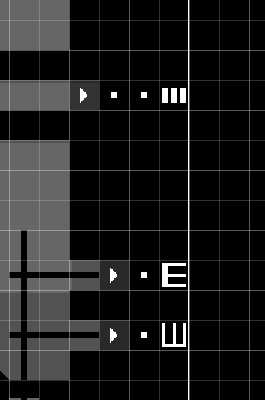
</figure>

Shortcut entrances have specific requirements in order to be recognized as valid. First, the 3x3 area of geometry around the shortcut entrance must be made of solid blocks, save for one block, where you enter the shortcut from, which should be either air or a platform (platforms are used for downward-facing shortcut entrances). So, for example, to create a shortcut entrance into a wall, you will place a single air block into the wall, and replace the next solid block in the hole with the shortcut entrance. Second, you must have a shortcut dot placed in the direction of the shortcut entrance. So, if you have an air block to the left of the shortcut entrance, you will need to begin the path of shortcut dots on the block to the right of the shortcut entrance.

If you have created a shortcut entrance correctly, the graphic for it will show an arrow pointing in the correct direction. Afterwards, you will use the "Shortcut Dot" tool to create a path for the shortcut. Each shortcut dot connects to the next. They will only connect on its four sides, so you can't have paths that go diagonally.

The other side of the shortcut path will be capped by one of several shortcut objects. The shortcut item that the path ends in changes the behavior of the shortcut.

| Tool | Description |
| -------- | ----------- |
|  Shortcut Entrance | Creates a bidirectional connection between two points in the same room.
|  Room Entrance | Creates a connection to another room. Known as the player entrance in the official level editor, and displayed as a letter "P" in other level editors. |
|  Creature Den | Known as the Dragon Den in the official level editor. This is a place for creatures other than the slugcat to spawn and hibernate in during the rain.
|  Whack-a-mole Hole | A shortcut only accessible to creatures other than the slugcat. Creatures who enter can exit through any other whack-a-mole hole in the room.
|  Scavenger Hole | Allows scavengers to spawn in or travel to this room as they wander through a region.
|  Shortcut Dot | You can end a shortcut path with a shortcut dot. The shortcut will be valid, but not enterable.

Here are some examples of valid shortcuts:

=== "Shortcut in wall"
    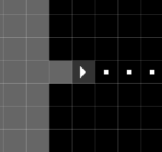

=== "Shortcut in floor"
    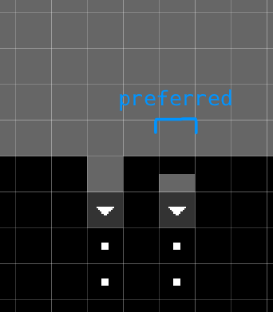

=== "Floating shortcuts"
    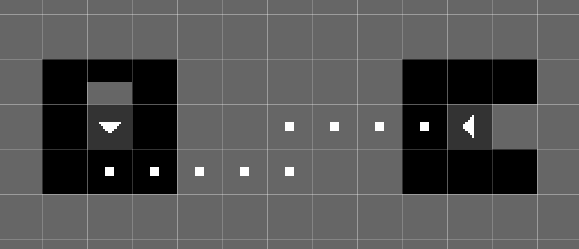

=== "No shortcut dots"
    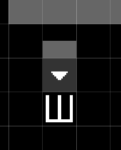

And here are some examples of invalid shortcuts:

=== "Invalid configuration"
    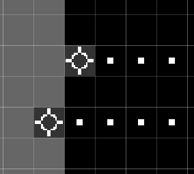

=== "Outside of level border"
    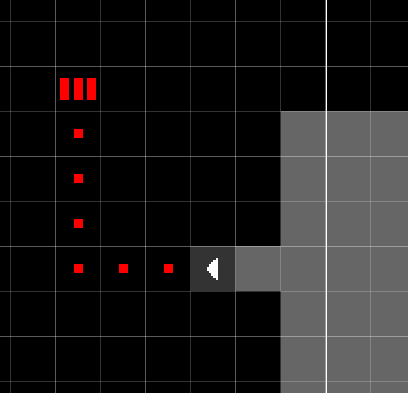

## Layer mask
There are three toggle buttons below the tool selector, labeled "Layer 1", "Layer 2", and "Layer 3". These checkboxes
control the layer mask, which controls the layers tool interactions manipulate. You may enable/deactivate each layer by
clicking on the checkboxes or by using the <kbd>E</kbd>, <kbd>R</kbd>, and <kbd>T</kbd> keys on your keyboard.
Alternatively, you may press <kbd>Tab</kbd> to shift the layer mask downwards. If you have only one layer selected, this
has the same effect as selecting the next layer.

## Mirroring
Below the layer mask configuration are the options for mirroring. The checkbox labeled "Mirror X", if enabled, will enable horziontal mirroring for tool interactions about the red line that will appear. "Mirror Y", if enabled, will do the same for vertical mirroring.

Each mirror split can be moved by clicking and dragging it. Holding down <kbd>Shift</kbd> while dragging a mirror split will snap it to the edges of cells, ignoring their centers. The split can be recentered by double-clicking on it.