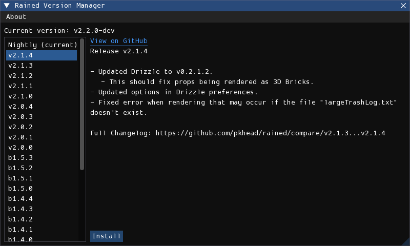

# Installation and Updates
There are two methods of installing and updating Rained: from the GitHub releases page, or using rainedvm. You can use both methods interchangeably.

## From GitHub
You can install Rained from the [GitHub releases page](https://github.com/pkhead/rained/releases). Download the archive (.zip or .tar.gz) for your platform and extract it to disk. Execute the file named "Rained.exe" or "Rained" to launch Rained. If you are on Windows, there will also be an executable named "Rained.Console.exe", which exists to be ran from the terminal or from a command-line tool. On Linux, there is no need for such a separation, so the file is not included.

Rained should notify you of any new updates upon startup or in the About window. You may disable the update checker in the preferences window.

If you want to update Rained, you should remove and replace all the files and folders from the installation folder **except**:

- config/
- Your Data folder, if present.

Then, download and extract the new version of Rained from the releases page.

You should ensure that any potential changes you made in any files aren't accidentally overwritten. Additionally, if you open Rained after updating and the windows are messed up, you should either fix it yourself (tedious), or replace config/imgui.ini with the version from the new update.

## rainedvm
rainedvm is a program that eases the process of maintaining Rained versions. Downloads are [here](https://github.com/pkhead/rainedvm/releases).

Inside the .zip or .tar.gz download is the executable `rainedvm`. Simply extract it and drop it in the folder where you want to install Rained. Then, launch the executable, which should open a window that looks like this:

<figure markdown="span">
    
</figure>

Select the version you want to install and then press the "Install" button. Once, done you can run Rained from your file manager.

Rained should notify you of any new updates upon startup or in the About window. You may disable the update checker in the preferences window.

If you want to update Rained, run rainedvm again, select the version you want to upgrade to, and press "Install". If you launch Rained after updating and the windows are messed up, delete the config/imgui.ini file, select the version you are on in the version manager, and press "Sync", which replaces the "Install" button. This will reset the window configuration to the default for that version.

### File conflicts
rainedvm will detect if you have modified any files (other than config/preferences and config/imgui.ini) and if that file had been changed in the new version, will ask you if you want to either overwrite the changes with the new version, or keep your file changes. On each prompt, if you want the file to be updated, select "Overwrite Changes". Otherwise, select "Keep Changes". You may also cancel the entire operation at that point by pressing the "Cancel" button.

## Dependencies
!!! note

    This section is only relevant if you are running Rained on Windows.

The only dependency Rained has is the Microsoft Visual Studio C++ runtime. Rained *is* programmed in C#, but some of the libraries it uses for windowing and graphics were programmed in C++, which is why it is required.

To check if you have the required dependency installed or not, simply try running Rained. If it can't open a window and fails to launch, it's likely that you will need to install it. Fortunately, it is very simple. The installer for the C++ runtime can be downloaded [here](https://aka.ms/vs/17/release/vc_redist.x64.exe). Run the executable and once the installation process is finished, you now can run Rained.