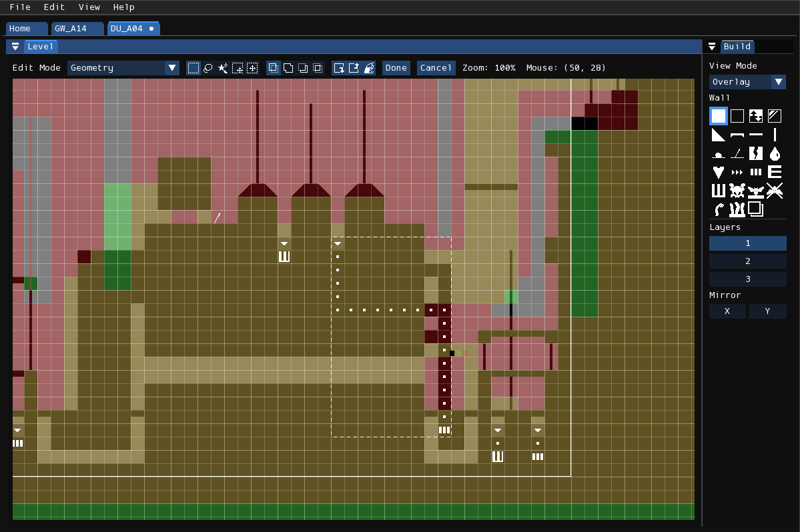
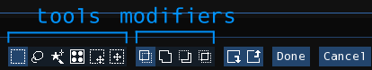
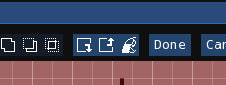

# Selection

<figure markdown="span">
    
</figure>

In the geometry and tile editor modes, you can enter a selection mode by pressing **Edit > Select**. This mode can be used for moving regions of geometry, duplicating them, or copying and pasting them into different levels.

There are three selection layers, one for each work layer. The selection outline in the first layer is colored white, the second green, and the third red. (These changed be changed in Preferences.) Each selection layer will only affect cells in the work layer it resides in.

With a selection active, press **Edit > Copy** to copy the selection into the system clipboard. Press **Edit > Paste** afterwards to paste from the system clipboard. Pressing the "Done" button, or pressing <kbd>Enter</kbd>, will submit the current cell movement operation and exit selection mode. Pressing "Cancel" or <kbd>Esc</kbd> will cancel the current operation and exit cell selection mode.

## Toolbar
<figure markdown="span">
    
    <figcaption>Selection mode toolbar in the tile editor.</figcaption>
</figure>

### Tools
In this mode, the status bar will be used for changing selection tools and modifiers. There are five tools you may choose from:

1. **Rectangle Select**: Click and drag in the level to select a rectangular region of cells.
2. **Lasso Select**: Click and drag in the level to trace the outline of the region of cells you want to select.
3. **Magic Wand**: Click to select the contiguous region of the level under the mouse. This only selects cells from the active layer.
4. **Tile Select**: *(Tile editor only)* Click to select the cells occupied by the tile under the mouse cursor. Selects from one or two layers.
4. **Move Selection**: Click and drag to move the selection. This does not affect any cells.
4. **Move Selected**: Click and drag to move the selected cells.

### Modifiers
There are also four boolean modifiers mode you can choose from. These affect how any newly created selection areas interact with the selection areas created before it.

1. **Replace**: Discard the old selection, completely replacing it with the new one.
2. **Add**: Add the old and new selection together.
3. **Subtract**: Subtract the new selection from the old selection. This removes the areas where the selections intersect.
4. **Intersect**: Keep only the areas where the new and old selection intersect.

### Buttons
<figure markdown="span">
    
    <figcaption>Buttons in the geometry editor</figcaption>
</figure>

There are also three buttons used for modifying the selected cells:

1. **Move Selected/Selection Backward**: Move the selected cells backwards. If <kbd>Shift</kbd> is held, it will only move the selection without affecting the cells.
2. **Move Selected/Selection Forward**: Move the selected cells forward. If <kbd>Shift</kbd> is held, it will only move the selection without affecting the cells.
3. **Geometry Fill**: *(Geometry editor only)* This will fill the selection area with the currently selected geometry tool.