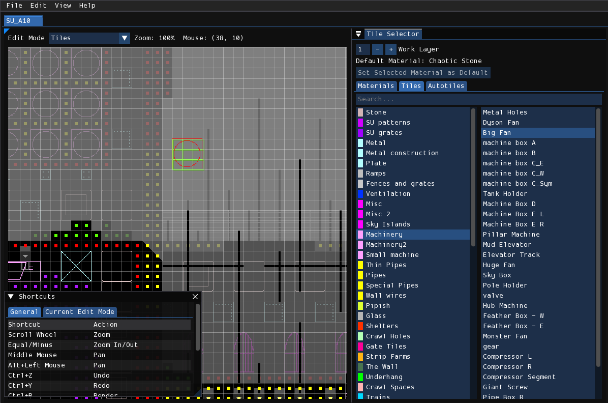
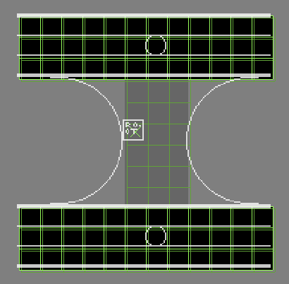

# Tiles

The tile editor is where you decorate the level with materials and tiles. Editing tiles and materials is a crucial part of the level editing process, and is normally done after creating an initial block-out of the level in the geometry editor, and usually afterwards is worked on in tandem with the geometry editor. Forming a basic understanding of the principles of tiling is key to designing a good-looking level (although this manual will not delve into the general principles of tile design).

## Materials
Materials are used to essentially apply textures to the geometry of your level. I say "essentially", because different materials have different processes of detailing the geometry. Some are simply large repeated textures overlaid onto the affected area, some add certain graphics onto edges and corners, and some, like the Trash family and Small Pipes, are procedurally generated details.

### Selection
**TODO: Figure of materials tab + level with materials**

Material editing can be accessed by switching to the "Materials" tab in the tile selector window. With that tab active, you can select which material you want to paint the level with. The left column shows the list of material categories, and the right column shows the list of materials available for the selected category. Furthermore, hovering over an item on the right column will show a pop-up preview of the material's graphics over the mouse.

### Placement
Applied materials are shown in the level view as small solid-colored squares positioned in the center of a cell. Do note that materials will not be visualized if the cell is also occupied by a tile. Removing the tile will expose the material underneath, but any materials obscured by tiles will not be saved in the file.

To paint geometry with a material, simply hold down the left mouse button. To erase materials from geometry, hold down the right mouse button. You can also change the size of the brush by holding down <kbd>Shift</kbd> and using the scroll wheel. Additionally, holding down <kbd>Shift</kbd> and the left or right mouse button and then dragging your mouse will allow you to fill or erase a rectangular area.

There are two placement/erasure modifiers you can use while painting. The first is "Force Geometry", which is activated by holding down the <kbd>G</kbd> key. This will allow you to paint onto empty space, where Rained will then automatically place wall geometry onto the area to allow the material to be placed. The second is "Ignore Different", activated by holding down the <kbd>R</kbd> key. It will prevent modification of any materials different than the material that you started painting over at the start of the stroke. It can also be active simultaneously with the "Force Geometry" modifier.

## Tiles
A tile is a premade art asset that you can place in a level. Each tile was drawn by someone in an image editor or paint program, depicting things such as metal beams, pipes, stones, machines, and other set pieces.

Functionally, they behave similarly to tiles in tile-based games/level editors, but there are a few things specific to Rain World's version of tiles.

1. Tiles can be of any grid-aligned width and height.
2. Each tile has a geometry specification, which limits/forces the pattern of geometry the tile can be placed on.
3. Tiles can have either one or two layers of depth.
4. Parts of a tile can be removed and the tile will still render as normal.

### Placement
In order to place a tile, you first must select the tile you want to place in the tile selector, depicted below. The left column displays tile categories, and the right column displays tiles in the currently selected tile category. Hovering over an item in the right column will show a pop-up preview of the tile, and clicking on it will select that tile.

<figure markdown="span">
    
    <figcaption>The tile selector.</figcaption>
</figure>

With a tile selected and your mouse over the level view, a preview of the tile will display over your mouse which is called the "tile cursor". Pressing down the left mouse button will place down the tile at that position. and pressing down the right mouse button will remove the tile that is being hovered over. You can also place or remove a rectangular area of tiles by holding <kbd>Shift</kbd> before pressing either the left or right mouse button.

You may switch work layers either by pressing <kbd>Tab</kbd> or interacting with the "Work Layer" input box located on the very top of the "Tile Selector" window. 

### Geometry Specifications/Requirements
Each tile specifies the pattern of geometry that the tile occupies. This is referred to as "geometry/tile specs", "geometry/tile requirements", or simply "specs". These specs in Rained are shown as green outlines behind the tile cursor in the level view. The specs for the first layer are shown as a bright green, and the specs for the second layer, if demanded by the tile, are shown as a dark green.

<figure markdown="span">
    
</figure>

The requirement of each individual cell should be obvious---as it shows an outline of the required geometry type at that cell---except for two cases:

- **Unspecified**: This will not show an outline at a given cell. This means that any kind of geometry is tolerated at that space, and if the tile is placed down with the "Force Geometry" modifier that space will not be modified.
- **Air**: This will show as a cross, meaning that the geometry at that space must be an air cell.

### Modifiers
Normally, you will not be able to place down a tile if the geometry under the cursor does not meet the specifications for the selected tile. In this case, the cursor tile preview will be colored red instead of white. However, you can force Rained to place down the tile regardless of the underlying geometry if you have either the "Force Placement" or "Force Geometry" modifiers active.

In order to activate the "Force Placement" modifier, you must have the <kbd>F</kbd> key held down. Once this is active, you may
place down a tile regardless of if the underlying geometry fits the requirements of tile's specs. The "Force Geometry" modifier, activated by holding down the <kbd>G</kbd> key, will instead, upon placement, modify the geometry underneath the tile to fit the tile specs. This way, you don't have to labouriously manually place the geometry down for any large or complex tiles. Additionally, if you remove a tile with "Force Geometry" active, it will remove the tile's required geometry along with the tile itself.

These modifiers also work with the rectangular-area fill/erase feature, but "Force Geometry" has a special behavior depending on if you tap the key for a short amount of time while the rectangle is active, or if you don't. If tapped, it will place the required geometry for the already-placed tiles underneath the rectangle, and close the rectangle. Otherwise, geometry-forced tiles will be placed if the modifier is held down when the mouse button is released.

### Heads and Bodies

Rain World handles tiles differently than one would intuit. Normally, a tile appears as and behaves like a singular whole when editing, but in reality a tile is composed of multiple "atoms", each of a 1x1 grid size, that are arranged to form the whole tile. For each placed tile, there is one tile head and zero or more tile bodies that make up the tile.

**TODO: figure visually demonstrating tile bodies and heads**

The center of every tile is the tile head, which is required for a tile to exist as it is the component that references the tile being rendered. The tile body is surrounded by tile heads each of store a reference to their corresponding tile head. Rained knows which portion of the texture to render for each tile body based by their position relative to its tile head. You may highlight each tile head in the level by enabling `View > Tile Heads`.

It is valid for a tile to be missing some tile bodies. You can do so by force-placing another tile over another one, which will remove some tile bodies of the tile being overlapped. However, you cannot place a tile in such a way that it overwrites the tile head, no matter what modifier you use, since by doing so all tile bodies reference by the tile head will become invalid.

In regards to rendering, tile bodies that are missing do not cause the render to be missing those parts of the rendered tile; the tile in its entirety will still be rendered. However, it does affect how the geometry at that tile body is rendered. Without a tile body the geometry will be rendered overlapping with the tile graphics, whereas with a tile body there will be no rendered geometry at that cell.

### Tile Graphics
The image displayed by default in Rained for the visual representation of tiles is not what actually gets rendered in-game. Rather, it is a crude representation of the tile. These images are, by defualt, used in place of the real tile graphics while editing the level due to concerns of performance and video memory. However, you can choose to have Rained render tile graphics using their actual in-game representation by toggling `View > Tile Graphics`. Out of the box, tiles will be colored using their respective category colors, but for a more accurate in-game representation you may also enable palette rendering through the `View > Palettes` window.

Note that the tile graphics preview is inaccurate in regards to geometry rendering. When rendering, any cell that is occupied by a tile head or tile body will not have their geometry rendered so that the tile can display properly. This therefore means that if a tile requires solid geometry for any cell but has empty space in that portion of the graphic, Rained will display that cell as solid but in reality that cell will be invisible when rendering. A specific example of a tile that exhibits this behavior is "Ventilation Box Empty".

<figure markdown="span">
    
    <figcaption>The tile as is displayed in Rained.</figcaption>
</figure>

<figure markdown="span">
    
    <figcaption>The tile render as is shown in-game. Note how the solid geometry in the tile is not rendered.</figcaption>
</figure>

## Autotiles
TODO